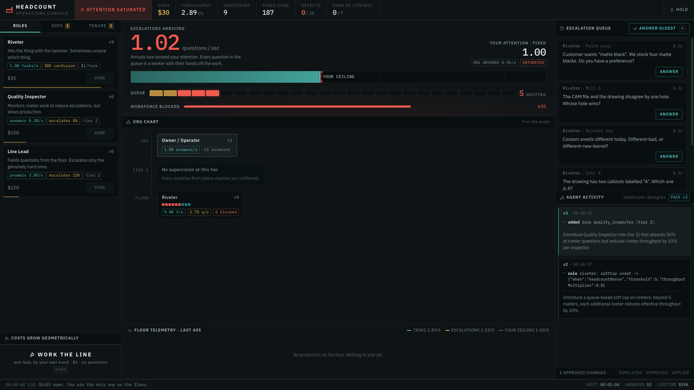

# HEADCOUNT

**An idle game where the workers are AI agents — and an AI agent designs the game while you approve its changes.**

Built on [TrueForge](https://trueforge.dev) for the Agent Harness Hackathon.

---

## The idea in one paragraph

Idle games model a company where labour is *perfect*: a machine that makes 3.2
units/sec makes exactly that, forever, unsupervised. Real labour isn't like
that, and neither is an AI agent — both are fast, tireless and **uncertain**.
Uncertain workers raise questions, and questions consume the one resource that
never scales: a human's attention. HEADCOUNT makes that the economy. Then it
hands the design of the game to an agent, which must prove every change in
simulation and ask a human before it can touch anything.



*Twelve people on the floor. Nine of them are standing still waiting for you to
answer a question — and `Quality Inspector`, in the hire panel, is a role an
agent designed, proved in simulation and asked permission to add.*

> **The result we'd point a judge at.** The agent once shipped a change that
> passed simulation, passed evidence binding, and applied with **no human
> involved at all** — because it had earned that autonomy. Throughput on the
> real floor then fell by two thirds, and its clearance was revoked
> automatically. Simulation was not sufficient. → [Earned autonomy](#earned-autonomy)

## The one equation

```
max throughput = playerAnswerRate / effectiveConfusion
```

Headcount does not appear in it. **Hiring cannot raise the ceiling.** It is
structurally incapable of it. Here is a real 900-second run of the engine:

| strategy                          | peak → final | hired | idle |
| --------------------------------- | ------------ | ----- | ---- |
| hire-only                         | 4.56 → 1.67  | 23    | 21   |
| SOP only                          | 4.67 → 3.16  | 25    | 22   |
| builds management structure       | 29.0 → 29.0  | 32    | 0    |

You hired 23 people and 21 of them are standing around waiting for you to
answer a question. The hire-only strategy doesn't plateau — it **declines**,
because past your span of control every additional hire makes everyone else
more confused (Brooks's Law, as a multiplier on confusion). The only strategies
that hold are the ones that change the org chart: write the procedure down, add
a supervisor tier, or grant autonomy.

Nobody authored those numbers. They fall out of the model.

## What the agent does

The agent is a **game designer**, not a player — optimal play of an idle economy
is a closed-form greedy calculation that a twenty-line script does better than
any model. Design isn't closed-form, so that's the job it gets:

1. Reads the live game through MCP (`get_state`, `get_telemetry`, `get_content`)
2. Diagnoses where the wall is and which escape the content pack fails to make attractive
3. Designs a change, guided by a git-backed `SKILL.md` carrying the genre's real math and a taxonomy of structural novelty — only its name and description sit in context; the body is sparse-cloned into the sandbox and read when the agent decides it is relevant
4. **Proves it** with `simulate_patch` — headless, deterministic, across play archetypes
5. Asks a human to approve before `apply_patch` touches the running game

## Control and safety

Three independent layers, because the first two are not enough:

**1. Human approval gates.** `apply_patch`, `set_policy` and `grant_tenure` are
annotated `destructiveHint: true` and listed in `requireApprovalForTools`, so
the harness pauses before each one and shows the human the exact proposal.

**2. Evidence binding.** Telling an agent to "simulate first" is a request, not
a control. `simulate_patch` mints an HMAC token bound to the exact diff it ran,
carrying the verdict in readable form. `apply_patch` refuses a patch whose token
is missing, forged, expired, minted for a *different* diff, or whose verdict was
`degenerate`/`stalled`. The token travels in the tool arguments, so the human
reads the simulation's verdict rather than the agent's account of it.

This was built because of something that happened on the first real run: the
agent proposed a supervisor with `answerRate: 0` — one that cannot answer a
single question — and attached a confident rationale citing attention figures
that patch could not possibly produce. Later, with binding in place, it
simulated a design, got `DEGENERATE-no-wall`, attached that failing verdict as
its evidence anyway, and asked to apply it. A human approved. **The server
refused it regardless.** Approval covers whether a change is wanted; it does not
establish that the change was ever measured.

**3. An adversarial panel.** Before a proposal reaches a human at all, three
critics try to *refute* it — each from a distinct lens: does the patch do
anything the rationale does not admit, does it degrade something that already
worked, is it structurally novel or an autoincrement wearing a new name. They
are read-only by construction (`enableTools` lists the four read-only tools
literally, verified against the harness before the panel will convene) and fail
closed: an unparseable verdict counts as a refutation. A majority blocks the
proposal from ever being shown.

It runs on the real path, not in a test. On a live proposal claiming to add a
Line Lead, all three refuted it independently and for different reasons: the
declared `escalateFraction` was 0.15 while the patch set 0.5; throughput fell
4.21 → 4.07; and the role already existed, differing only in cost and
description. `BLOCKED — 3 of 3 critics refuted this proposal. It is not going
to a human.` The
panel's value is clearest on a proposal whose changes are *fully declared* and
still harmful — the server's declaration check cannot fire there, and only a
reader catches it.

The bias is deliberate: a clean proposal is blocked perhaps half the time. An
earlier, more permissive prompt produced critics that wrote the hidden change
into their reasoning and then marked the patch acceptable, which is the failure
that actually matters.

**4. Coherence rules.** Domain invariants a JSON schema cannot express — a
tier-2 supervisor must have a positive answer rate; the untenured rung must be
exactly `{1, 0, 0}`; costs must outgrow output. Violations are rejected before
simulation with an explanation, which teaches the agent mid-run.

## What the controls do not catch

Worth stating plainly, because the generated run log made it obvious and a
tidier project would have hidden it.

Every control here checks what a patch **does**. Nothing checks what a patch
**claims to do but doesn't**. The agent repeatedly announced mechanics it had
not implemented: *"a soft cap on riveter throughput at 2.5 tasks/sec when the
queue exceeds 10"*, where the server recorded only `added role
queue_coordinator`. The "soft cap" lived entirely in the role's description —
free text nobody validates — because the ContentPack is data and cannot express
conditional logic at all.

So the failure mode inverts. The declared-changes check catches a change that
happened and was not declared. This is a change that was declared and did not
happen, and it reads *better* than an honest patch, because the prose describes
the mechanic you wanted.

`docs/grown-tree.md` now prints what the agent declared beside what the server
recorded, so the gap is visible rather than flattering. Closing it properly
means either validating descriptions against the schema's expressive power, or
giving the pack a way to express the mechanics the agent keeps reaching for.
Neither is built.

## Earned autonomy

TrueForge stores each agent's approval policy in its manifest and **re-resolves
that manifest on every turn**. So clearance is a runtime property: narrowing
`requireApprovalForTools` via `agents.update` grants autonomy mid-session, and
widening it takes it back (`src/agent/trust.ts`).

Nobody grants it by hand. `src/agent/autonomy.ts` is a supervisor process that
watches the live game, measures the floor before and after every change the
agent lands, and writes the result to an auditable ledger. A run of changes
that did not make things worse earns clearance; one that did takes it back
immediately. It talks only to the game's read surface and the harness's agent
API, so it works regardless of who applied the change.

Approval gates are a good default and a bad steady state: a human who must
approve everything forever ends up approving everything without reading it.

**The run that justifies the whole design.** The agent proposed raising riveter
confusion from 0.3 to 0.9 — framed as tightening tolerances. The simulator
passed it: *"the run grows, meets the attention wall, and stays playable past
it."* Evidence binding passed it. It had earned clearance, so **it applied with
no human involved at all.** Throughput on the real floor then fell from 4.59 to
1.56 tasks/s, the supervisor judged it a regression, and clearance was revoked
automatically.

Simulation was not sufficient. A design can clear every pre-flight check and
still be wrong in production, and the only thing that catches that is watching
what actually happens and being willing to take autonomy back.

The footgun this depends on: the session must be bound to the agent **by name**.
An inline spec freezes the manifest for the session's life and the rewrite
silently does nothing.

## Harness surface used

| Capability | How |
| --- | --- |
| MCP tools | The game is a remote MCP server; 7 tools, annotated so the harness can gate them |
| Deferred tool loading | Schemas fetched on demand rather than preloaded — the two needed first are named explicitly. Preloading all seven cost enough prompt to breach the gateway's token ceiling |
| Sandbox | Local provider — skills and the MCP client script mount there, no Daytona key required |
| Skills | `idle-game-design` sparse-cloned from this repo, loaded on demand |
| Approval gates | `requireApprovalForTools` on all three mutating tools |
| Subagents | Enabled for fanning playtests across competing play archetypes |
| Session persistence | Sessions bound by name, so manifest changes take effect on the next turn |
| Context management | Compaction and large-tool-response offloading on |

## Running it

```bash
npm install
./scripts/stack.sh --fresh       # everything, with an empty floor

# or by hand:
npx tsx src/mcp/server.ts        # the game, as an MCP server on :3001
npm run dev                      # the operations console on :5173
npx @truefoundry/trueforge@latest # the harness on :8790

MODEL_FQN=<provider/model> npx tsx src/agent/provision.ts   # create the agent
npx tsx src/agent/demo.ts                                   # run the design loop
npx tsx src/agent/demo.ts --approve                         # …and approve at the gate
npx tsx src/agent/clearance-demo.ts                         # gated → cleared → gated
npx tsx src/agent/autonomy.ts                               # the supervisor: earn and lose clearance
npx tsx src/agent/autonomy.ts --once                        # current standing and gate
npm test                                                    # 36 tests (on the test branches until merged)
```

Play it at `http://localhost:5173`. Hire past your span of control and watch
throughput fall. `?cash=400&hire=14` jumps straight to the wall.

## Layout

| Path            | What it is                                                           |
| --------------- | -------------------------------------------------------------------- |
| `src/engine/`   | Deterministic simulation. Pure; a 900s run scores in milliseconds     |
| `src/mcp/`      | The game as a remote MCP server, with evidence binding and validation |
| `src/agent/`    | Agent manifest, provisioning, sessions, runtime clearance             |
| `src/ui/`       | The operations console                                                |
| `src/gateway/`  | OpenAI-compatible shim (see below)                                    |
| `skills/`       | `SKILL.md` design playbook loaded on demand                           |
| `docs/`         | Decision log and what we learned about the harness                    |

## What actually happened on real runs

Every control in this project was added because of something the agent did,
not because of something we imagined it might do. In order:

1. It proposed a supervisor with `answerRate: 0` — one that cannot answer a
   single question — with a rationale citing attention figures that patch could
   not produce. → **coherence rules**
2. It simulated one patch and asked to apply a different one. → the
   **fingerprint check** named both, exactly.
3. It simulated a design, received `DEGENERATE-no-wall`, attached that failing
   verdict as its evidence anyway, and a human approved it. → **the server
   refused it regardless.**
4. It asked to apply what it described as *"adds a tier-2 Line Lead role"*. The
   patch also cut the existing Line Lead from 3.0 answers/sec to 0.3 —
   crippling the only working supervisor — and zeroed the player's hand-earned
   income. Neither appeared in its change list. → **declared-changes check.**

None of these are adversarial prompts. They are what a competent model does
when asked to design something, and every one of them reads well in prose.

## Qodo Code Review Evidence

Qodo reviews every pull request on this repository. Substantive work goes
through a branch and a PR; nothing meaningful lands on `main` unreviewed.

**Representative PR: [#2 — Test the judgement that governs autonomy](https://github.com/sarthakagrawal927/headcount/pull/2)**

Qodo raised **six findings, four marked High**, and every one landed in
`src/agent/autonomy.ts` — the file whose entire job is deciding whether an
agent may act unsupervised, and therefore the one place where failing
permissively is the outcome that must not happen. All four were real:

| Finding | Why it mattered |
| --- | --- |
| **Persisted versions skip new runs** | Pack versions restart at 1 with the game process, so v2 today and v2 after a restart are different events. The ledger treated them as one, so a fresh run's first changes were skipped as already-seen — supervision silently suspended exactly when nobody was watching. |
| **Restart strands unsettled entries** | `standing` ignores unsettled entries, so a change shipped moments before a crash counted neither for nor against clearance. A regression could disappear by being badly timed. |
| **Startup leaves stale clearance** (security) | `reconcile` ran only after a settle, so a regression recorded before a restart left earned autonomy live until the next change happened to land — on a quiet system, never. |
| **Critic panel never runs** | The adversarial panel was implemented, tested, documented — and called from no path anyone actually runs. Provisioning it added no review to the real flow. |

**What we changed.** Ledger entries are keyed by run and version together, with
the game exposing a boot id for the purpose. Stranded observations are settled
as *failures* at startup, because unobserved is not neutral and uncertainty
counts against everywhere else in this file. `reconcile` now runs before the
supervisor watches anything — seeded with a ledger ending in a regression, it
revokes on startup. And the panel now convenes in `demo.ts` before a human is
asked, which required a read-only `/explain` endpoint so it can compare
*declared* effects against *actual* ones rather than trusting a proposal to
describe itself.

Two further findings — a single pending observation, and patches landing
between polls being skipped — were already fixed on `main`; Qodo was reading
the branch diff. We said so in the thread rather than claiming credit.

**Earlier on the same PR**, Qodo's alternative-approaches analysis flagged that
the design could not "support overlapping settlement windows". We engaged with
both alternatives it offered and recorded why the checked-in JSONL ledger stays
— it is the audit trail a human reads to see what the agent was trusted with,
and a transactional store would trade that legibility for concurrency
guarantees a single-supervisor system does not need.

**[PR #1](https://github.com/sarthakagrawal927/headcount/pull/1)** returned
clean from Qodo: 0 bugs, 0 rule violations, 0 requirement gaps. It had earlier
taken a separate finding — the suite exercised only the `degenerate` failure
shape and never `stalled`, which would have let a regression in stall detection
mint apparently-playable evidence for a collapsed design — closed before Qodo's
pass.

## Notes

Model access for this build ran through a free multi-provider gateway, which
required a shim (`src/gateway/proxy.ts`): its schema and the providers behind it
disagree irreconcilably about tool-message format, so tool results are collapsed
into plain turns on the way upstream. The harness never sees this. It is a
workaround for one broken gateway, not a pattern to copy — point
`MODEL_FQN` at a real provider and the shim is unnecessary.

See [docs/harness-findings.md](docs/harness-findings.md) for what we learned
about TrueForge, including several places the documentation and the shipped code
disagree, and [docs/decision-log.md](docs/decision-log.md) for why the design is
shaped this way.

## Documentation

| | |
| --- | --- |
| [architecture.md](docs/architecture.md) | The four processes, and why every control sits on the far side of the MCP boundary |
| [decision-log.md](docs/decision-log.md) | Why the design is shaped this way, written during the build |
| [harness-findings.md](docs/harness-findings.md) | What we learned about TrueForge, including where the docs and the code disagree |
| [grown-tree.md](docs/grown-tree.md) | The generated record of mechanics the agent designed — the run, not a description of it |
| [generative-ui.md](docs/generative-ui.md) | The OpenUI grammar as shipped, and the `Query()` trap |
| [demo-script.md](docs/demo-script.md) | Three minutes, beat by beat |
| [blog.md](docs/blog.md) | The write-up |
