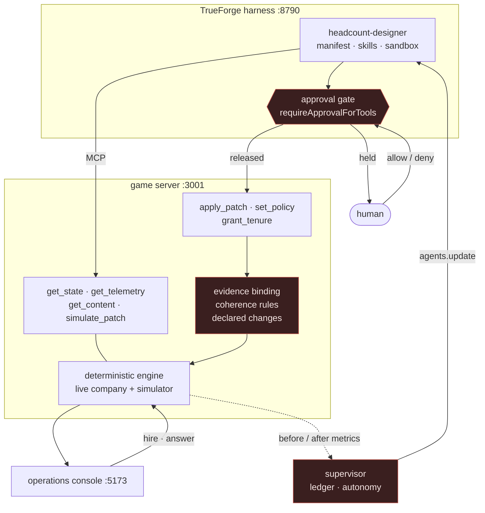

# Architecture

Four processes and one rule: **nothing reaches the running game that has not
been measured, declared, and either approved or earned.**

## The four processes

**The game server** (`src/mcp/`) holds one running company and exposes it twice:
as an MCP server for the agent, and as a plain HTTP read/action surface for the
console. Both act on the *same* company — the console is not a view of a private
copy, which is the only version of this worth building.

**The harness** runs the agent: model, instructions, MCP connectors, a
git-backed skill, a sandbox, and the approval policy. TrueForge re-resolves that
policy from the database on every turn, which is what makes autonomy a runtime
property rather than a deploy-time constant.

**The console** (`src/ui/`) is where a person plays. It attaches to the shared
company and follows the live content pack, so a change the agent lands appears
mid-shift.

**The supervisor** (`src/agent/autonomy.ts`) watches the floor, judges each
landed change against before/after metrics, and rewrites the agent's manifest
accordingly. It talks only to public surfaces, so it holds regardless of who
applied the change.

## Why the checks sit in the game server, not the agent

An agent asked to police itself is being asked a favour. Every control lives on
the far side of the MCP boundary, in the process that owns the data:

| Control | Refuses |
| --- | --- |
| Evidence binding | a patch that was not simulated, was tampered with, has expired, or whose own verdict failed |
| Coherence rules | invariants a JSON schema cannot express — a supervisor with no answer rate, costs that do not outgrow output |
| Declared changes | a change list that omits anything the patch actually does |

All three refuse **after** a human has approved. Approval establishes that a
change is wanted; it does not establish that the change was measured, coherent,
or honestly described. Those are different questions, and only the first can be
delegated to a person reading prose at the end of a long day.

## The determinism requirement

The engine applies error and defect rates as expected values rather than
sampling them. Identical inputs produce byte-identical telemetry.

This is not tidiness. The agent's design proposals are justified by simulation,
and a justification nobody can reproduce is not evidence. A human handed a
verdict must be able to re-run it and get the same answer, and a subagent
grading a hundred candidate designs must not be reading noise.

## Where the seams are

| Seam | Why it exists |
| --- | --- |
| `src/ui/useGame.ts` | one import switches the console between the shared company and a private in-browser one |
| `src/mcp/engineAdapter.ts` | the game server resolves engine functions dynamically and reports provenance, so it cannot silently diverge from the real physics |
| `src/agent/manifest.ts` | the agent spec is code, because the approval policy is API-only and needs to be diffable |
| `src/agent/trust.ts` | the only place that rewrites clearance, so every grant and revocation goes through one door |
